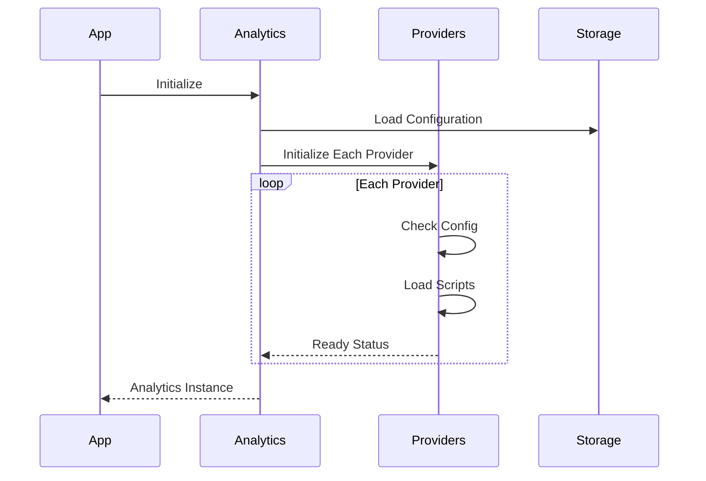
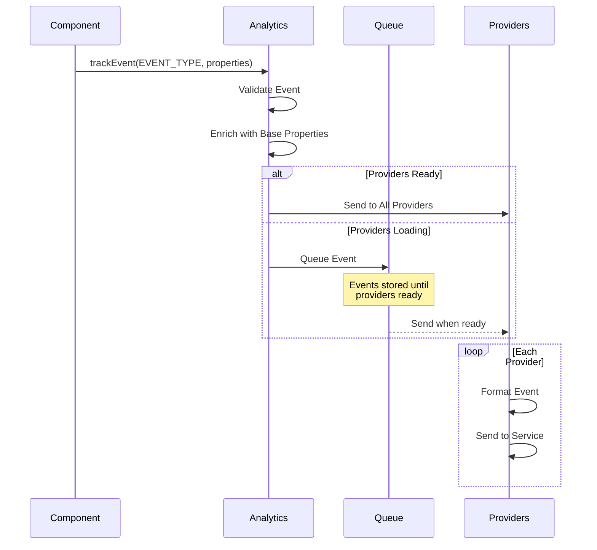

# Analytics and Event Tracking

A comprehensive analytics system to track user interactions and improve the user experience. The analytics system supports multiple providers (Google Analytics, PostHog) and includes automatic session and user tracking.

## Dependencies

```json
{
  "dependencies": {
    "analytics": "^0.8.9",
    "@analytics/google-analytics": "^1.0.7",
    "posthog-js": "^1.96.1",
    "@supabase/supabase-js": "^2.39.0",
    "uuid": "^9.0.1"
  }
}
```

To install the dependencies:

```bash
npm install analytics @analytics/google-analytics posthog-js @supabase/supabase-js uuid
# or using yarn
yarn add analytics @analytics/google-analytics posthog-js @supabase/supabase-js uuid
# or using pnpm
pnpm add analytics @analytics/google-analytics posthog-js @supabase/supabase-js uuid
```

### Anonymous User Tracking

The system automatically handles anonymous users by:
1. Generating a unique anonymous ID on first visit
2. Storing the ID in local storage
3. Attaching it to all subsequent events

Here's how it's implemented:

```typescript
// src/utils/anonymousId.ts
import { v4 as uuidv4 } from 'uuid';

const ANONYMOUS_ID_KEY = 'anonymous_user_id';

export function getAnonymousId(): string {
  let anonymousId = localStorage.getItem(ANONYMOUS_ID_KEY);
  
  if (!anonymousId) {
    anonymousId = uuidv4();
    localStorage.setItem(ANONYMOUS_ID_KEY, anonymousId);
  }
  
  return anonymousId;
}
```

The analytics initialization includes this anonymous ID:

```typescript
// src/utils/analytics.ts
import Analytics from 'analytics';
import { getAnonymousId } from './anonymousId';

export const analytics = Analytics({
  app: 'your-app-name',
  debug: configLoader.getValue('ANALYTICS_DEBUG', 'false') === 'true',
  plugins: [
    // ... other plugins ...
  ],
  anonymousId: getAnonymousId()
});
```

When a user signs in, we can associate the anonymous ID with their user ID:

```typescript
// src/hooks/useAnalytics.ts
export function useAnalytics() {
  const identifyUser = useCallback((userId: string, traits?: Record<string, unknown>) => {
    const anonymousId = getAnonymousId();
    analytics.identify(userId, {
      ...traits,
      anonymousId,
      previousAnonymousId: anonymousId
    });
  }, []);

  return {
    // ... other methods ...
    identifyUser
  };
}
```

This enables:
- Tracking users before they sign up/login
- Connecting pre-auth activity to post-auth users
- Maintaining consistent user journeys across sessions
- Complying with privacy regulations by allowing anonymous data deletion

## Architecture and Implementation

### Module Structure

```
src/
├── types/
│   └── analytics.ts      # Type definitions and interfaces
├── utils/
│   ├── analytics.ts      # Main analytics configuration
│   ├── providers/        # Analytics provider implementations
│   │   ├── google.ts
│   │   ├── posthog.ts
│   │   └── console.ts
│   └── config.ts         # Configuration loader
└── hooks/
    └── useAnalytics.ts   # React hook for analytics
```

### Setup Flow

The analytics system is initialized when your application starts. Here's how the different pieces work together:



### Event Tracking Flow

When tracking events, the system handles the distribution to all configured providers:



### Implementation Example

1. Initialize analytics in your app:

```typescript
// src/utils/analytics.ts
import Analytics from 'analytics';
import { googleAnalyticsPlugin } from '@analytics/google-analytics';
import { configLoader } from './config';
import { consolePlugin } from './providers/console';
import { posthogPlugin } from './providers/posthog';

export const analytics = Analytics({
  app: 'your-app-name',
  debug: configLoader.getValue('ANALYTICS_DEBUG', 'false') === 'true',
  plugins: [
    consolePlugin,
    googleAnalyticsPlugin({
      measurementId: configLoader.getValue('GA_TRACKING_ID')
    }),
    posthogPlugin({
      apiKey: configLoader.getValue('POSTHOG_API_KEY'),
      apiHost: configLoader.getValue('POSTHOG_HOST_URL')
    })
  ]
});
```

2. Create a React hook for easy use:

```typescript
// src/hooks/useAnalytics.ts
import { useCallback } from 'react';
import { analytics } from '../utils/analytics';
import { EventType, EventProperties } from '../types/analytics';

export function useAnalytics() {
  const trackEvent = useCallback((eventType: EventType, properties?: EventProperties) => {
    analytics.track(eventType, properties);
  }, []);

  const identifyUser = useCallback((userId: string, traits?: Record<string, unknown>) => {
    analytics.identify(userId, traits);
  }, []);

  return {
    trackEvent,
    identifyUser,
    pageView: analytics.page,
    reset: analytics.reset
  };
}
```

3. Use in components:

```typescript
// src/components/Feature.tsx
import { useAnalytics } from '../hooks/useAnalytics';
import { EventType } from '../types/analytics';

export function Feature() {
  const { trackEvent } = useAnalytics();

  const handleFeatureUse = () => {
    trackEvent(EventType.FEATURE_INTERACTION, {
      featureId: 'feature-123',
      featureName: 'Cool Feature',
      action: 'button_click',
      duration: 5000
    });
  };

  return (
    <button onClick={handleFeatureUse}>
      Use Feature
    </button>
  );
}
```

### Provider Implementation

Each provider implements a standard interface:

```typescript
// src/utils/providers/base.ts
export interface AnalyticsProvider {
  name: string;
  config: Record<string, unknown>;
  initialize?: (props: { config: Record<string, unknown> }) => void;
  page?: (props: { payload: PagePayload }) => void;
  track?: (props: { payload: TrackPayload }) => void;
  identify?: (props: { payload: IdentifyPayload }) => void;
  loaded?: () => boolean;
}
```

Example provider implementation:

```typescript
// src/utils/providers/console.ts
import { AnalyticsProvider } from './base';

export const consolePlugin: AnalyticsProvider = {
  name: 'console',
  config: {
    logLevel: 'debug'
  },
  track: ({ payload }) => {
    console.log(`[Analytics] ${payload.event}:`, payload.properties);
  },
  page: ({ payload }) => {
    console.log(`[Analytics] Page View:`, payload.properties);
  },
  identify: ({ payload }) => {
    console.log(`[Analytics] Identify User:`, payload.userId, payload.traits);
  }
};
```

## Available Events

The application tracks the following categories of events:

### User Events
- `USER_SIGNED_UP`: When a new user registers
  ```typescript
  trackEvent(EventType.USER_SIGNED_UP, {
    userType: string,
    source: string,
    method: string
  });
  ```
- `USER_SIGNED_IN`: When a user logs in
- `USER_SIGNED_OUT`: When a user logs out
- `USER_UPDATED_PROFILE`: When a user updates their profile
- `USER_DELETED_ACCOUNT`: When a user deletes their account

### Feature Usage Events
- `FEATURE_VIEWED`: When a feature page/modal is viewed
  ```typescript
  trackEvent(EventType.FEATURE_VIEWED, {
    featureId: string,
    featureName: string,
    featureCategory: string,
    action: string,
    duration: number
  });
  ```
- `FEATURE_INTERACTION`: When a user interacts with a feature
- `FEATURE_COMPLETED`: When a feature flow is completed
- `FEATURE_ERROR`: When an error occurs during feature usage

### Content Events
- `CONTENT_VIEWED`: When content is viewed
  ```typescript
  trackEvent(EventType.CONTENT_VIEWED, {
    contentId: string,
    contentType: string,
    contentCategory: string,
    action: string,
    metadata: Record<string, any>
  });
  ```
- `CONTENT_CREATED`: When new content is created
- `CONTENT_UPDATED`: When content is modified
- `CONTENT_DELETED`: When content is removed
- `CONTENT_SHARED`: When content is shared

### Navigation Events
- `PAGE_VIEWED`: When a user navigates to a new page
  ```typescript
  trackEvent(EventType.PAGE_VIEWED, {
    path: string,
    referrer: string,
    title: string,
    searchQuery: string
  });
  ```
- `NAVIGATION_CLICKED`: When navigation elements are clicked
- `EXTERNAL_LINK_CLICKED`: When external links are clicked
- `SEARCH_PERFORMED`: When a search is executed

### Settings Events
- `SETTINGS_UPDATED`: When app settings are changed
  ```typescript
  trackEvent(EventType.SETTINGS_UPDATED, {
    settingName: string,
    oldValue: any,
    newValue: any,
    category: string
  });
  ```
- `PREFERENCES_CHANGED`: When user preferences are modified
- `NOTIFICATION_TOGGLED`: When notification settings are changed

### Subscription/Payment Events
- `SUBSCRIPTION_STARTED`: When a subscription begins
  ```typescript
  trackEvent(EventType.SUBSCRIPTION_STARTED, {
    amount: number,
    currency: string,
    productId: string,
    productName: string,
    paymentMethod: string,
    status: string
  });
  ```
- `SUBSCRIPTION_CANCELLED`: When a subscription is cancelled
- `PAYMENT_INITIATED`: When a payment process starts
- `PAYMENT_COMPLETED`: When a payment is successful
- `PAYMENT_FAILED`: When a payment fails

### Error Events
- `APP_ERROR`: When a general application error occurs
  ```typescript
  trackEvent(EventType.APP_ERROR, {
    errorCode: string,
    errorMessage: string,
    errorStack: string,
    componentName: string,
    metadata: Record<string, any>
  });
  ```
- `API_ERROR`: When an API request fails
- `VALIDATION_ERROR`: When form validation fails

## Adding New Events

To add new events to track:

1. Define the event type in `src/types/analytics.ts`:
```typescript
export enum EventType {
  // ... existing events ...
  NEW_EVENT = 'new_event'
}
```

2. Define the event properties interface in the same file:
```typescript
export interface EventProperties {
  // ... existing properties ...
  newProperty?: string;
}
```

3. Use the tracking functions in your components:
```typescript
import { trackEvent } from '@/utils/analytics';
import { EventType } from '@/types/analytics';

// Track a simple event
trackEvent(EventType.NEW_EVENT);

// Track an event with properties
trackEvent(EventType.NEW_EVENT, {
  newProperty: 'value',
  additionalData: 123
});
```

## Configuration

### Analytics Providers

The analytics system is configured in `src/utils/analytics.ts` with three default providers:

```typescript
// Initialize analytics with plugins
const analytics = Analytics({
  app: 'binaural-flow',
  debug: configLoader.getValue('ANALYTICS_DEBUG', 'false') === 'true',
  plugins: [
    consolePlugin,
    googleAnalyticsPlugin,
    postHogPlugin
  ]
});
```

Each provider has its own configuration and activation requirements:

1. Console Plugin (always active)
```typescript
const consolePlugin = {
  name: 'console',
  config: {
    logLevel: configLoader.getValue('ANALYTICS_LOG_LEVEL', 'debug')
  },
  // ... implementation
};
```

2. Google Analytics Plugin (activates with GA_TRACKING_ID)
```typescript
const googleAnalyticsPlugin = {
  name: 'google-analytics',
  config: {
    measurementId: configLoader.getValue('GA_TRACKING_ID')
  },
  initialize: ({ config }) => {
    if (!config.measurementId) return; // Won't activate without ID
    // ... implementation
  }
};
```

3. PostHog Plugin (activates with both key and URL)
```typescript
const postHogPlugin = {
  name: 'posthog',
  config: {
    apiKey: configLoader.getValue('POSTHOG_API_KEY'),
    apiHost: configLoader.getValue('POSTHOG_HOST_URL')
  },
  initialize: ({ config }) => {
    if (!config.apiKey || !config.apiHost) return; // Won't activate without both
    // ... implementation
  }
};
```

### Adding a New Provider

To add a new analytics provider:

1. Create a new plugin object following the analytics-js plugin structure:
```typescript
const newProvider = {
  name: 'provider-name',
  config: {
    // Provider-specific configuration
    apiKey: configLoader.getValue('PROVIDER_API_KEY')
  },
  initialize: ({ config }) => {
    if (!config.apiKey) return;
    // Initialize your provider
  },
  page: ({ payload }) => {
    // Handle page view events
  },
  track: ({ payload }) => {
    // Handle custom events
  },
  identify: ({ payload }) => {
    // Handle user identification
  }
};
```

2. Add the provider to the plugins array:
```typescript
const analytics = Analytics({
  app: 'binaural-flow',
  debug: configLoader.getValue('ANALYTICS_DEBUG', 'false') === 'true',
  plugins: [
    consolePlugin,
    googleAnalyticsPlugin,
    postHogPlugin,
    newProvider  // Add your new provider here
  ]
});
```

3. Add any necessary configuration values to your environment:
```env
PROVIDER_API_KEY=your_key  # Add provider-specific configuration
```

### Environment Configuration

Analytics can be configured through environment variables or remote configuration:

```env
ANALYTICS_DEBUG=true|false     # Enable debug logging
ANALYTICS_LOG_LEVEL=debug|info|warn|error  # Set console logging level
GA_TRACKING_ID=UA-XXXXX-Y     # Google Analytics tracking ID
POSTHOG_API_KEY=your_key      # PostHog API key
POSTHOG_HOST_URL=your_url     # PostHog host URL
```

## Debugging Analytics

To debug analytics in development:

1. Set `ANALYTICS_DEBUG=true` in your environment
2. Open browser console to see detailed event logs
3. Use the Network tab to verify events are being sent
4. Check analytics dashboards for real-time events

## Best Practices

1. Always include relevant context in event properties
2. Use consistent naming conventions for events and properties
3. Document new events in this file with example usage
4. Test events in development mode before deploying
5. Monitor analytics dashboards for tracking issues 